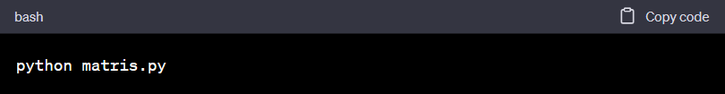
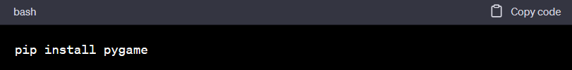

# Tetris Game in Python
 
This is a simple implementation of the classic Tetris game in Python.

<h2>Files and Folders</h2>
<ul>
<li>matris.py: This is the main game file. It contains the game logic, event handling, and rendering.</li>
<li>tetrominoes.py: This file defines the Tetris game pieces, known as tetrominoes.</li>
<li>scores.py: This file handles the game's scoring system.</li>
<li>resources: This folder contains additional resources needed for the game, such as images and sounds.</li>
<li>kezmenu: This folder contains code for a menu system.</li>
<li>gpl.txt: This is a text file containing the GNU General Public License. It states the terms under which the project's software is licensed.</li>
<li>demo.png: This is an image file, used to demonstrate how the game looks.</li>
 </ul>
<h2>Game Logic</h2>
The matris.py file is where the main game loop resides. This is where the game checks for user input, updates the game state, and renders the game state to the screen. The game utilizes a grid system, where each tetromino (game piece) is represented as a 2D array. The tetrominoes.py file defines each tetromino piece and their rotations as a 2D array. The game checks for collision when moving or rotating the tetrominoes. If a collision is detected, it stops the movement or rotation. When a row in the game grid is fully populated by pieces, the row is cleared and the score is increased.

<h2>Known Issues</h2>
<li> The game may not handle window resizing or minimizing/maximizing well. These events may cause graphical glitches or crashes.
<li>There is no pause functionality. If the user switches focus to another window, the game will continue running.</li>
<li>The game speed does not increase over time or as the score increases. This means the difficulty level remains constant, which is not typical for Tetris games.</li>
<h2>How to Run</h2>
To run the game, simply execute the matris.py file with Python:
  

<h2>Dependencies</h2>
The game requires the following Python library:

<li>pygame: This is a set of Python modules designed for writing video games. It provides functionalities for graphics, sound, and input handling. If you don't have it installed, you can install it using pip:</li> 
 

